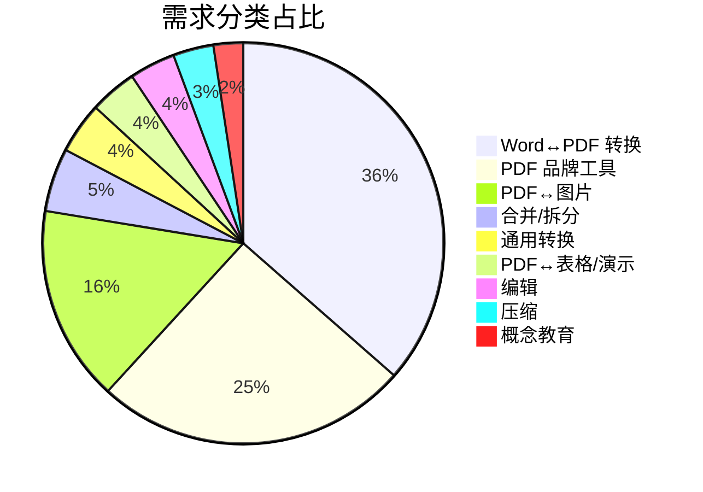

**what is a pdf** 在这批 53 条 Google Trends 数据里增长 650%，是搜索量 22 的一条小 query，却把整个传统 PDF 工具市场衬托得有些尴尬。同一批数据里，word to pdf converter 跌 40%，convertir word a pdf 跌 40%，jpg to pdf 跌 30%，unir pdf 跌 30%，大量 word、pdf to word、word to pdf、i love pdf、pdf merge、excel to pdf 这类传统格式转换 query 都躺在 -20% 到 -40% 区间。搜索兴趣总量没崩，只是形状换了。

PDF 是 Adobe 1993 年 6 月推出的格式，由 John Warnock 主导的 Camelot 项目做出来，基于 PostScript 语言。2008 年 ISO 32000 标准化，最新版本是 PDF 2.0，也就是 ISO 32000-2:2020。它在过去三十多年里还长出 PDF/A 存档、PDF/E 工程、PDF/UA 无障碍、PDF/VT 可变数据、PDF/X 印刷这些扩展。技术细节不用展开，只需要记住它本质是固定排版的渲染指令，优化的是跨平台打印和展示，不是结构化数据。这条性质决定了它在 AI 时代遇到的所有麻烦。

把 53 条 query 按需求归成 9 类，search interest 求和之后分布很集中。



Word↔PDF 转换 335，占 36.5%，是需求图谱里最粗的一条。PDF 品牌工具 233，占 25.4%。PDF↔图片 145，占 15.8%。三类加起来 77.7%，接近八成。剩下六类合并、拆分、通用转换、PDF↔表格/演示、编辑、压缩加总 225，占 22.3%。编辑 34，压缩 30，合并 47，这些传统工具市场里被反复宣传的功能点，加起来还没有 PDF↔图片 多。Word↔PDF 转换那一条 335 里，word 一条 query 就贡献 100，pdf to word 和 word to pdf 各 58，剩下 129 分散在 pdf to word converter、word a pdf、unir pdf、convertir pdf a word 这些长尾词。用户搜的不是"PDF 转换"这种大概念，是"word 怎么变成 pdf"、"pdf 怎么变成 word"这种具体动作。用户的实际需求很朴素，就是想换个格式，不是想编辑、合并、压缩。

需求分布是静态切片，增长率才是动态信号。

```mermaid
xychart-beta
    title "增长率 Top 5（Google Trends）"
    x-axis ["what is a pdf", "small pdf", "pdf 24", "pdf drive", "photo to pdf"]
    y-axis "增长率 %" -100 700
    bar [650, 450, 300, 80, 60]
```

what is a pdf 增长 650%，是概念教育类里唯一的 query，用户开始直接搜"PDF 是什么"。small pdf 增长 450%，pdf 24 增长 300%，这是两个中小品牌的名字。pdf drive 增长 80%，photo to pdf 增长 60%。同一批数据里，word to pdf converter、convertir word a pdf 都在 -40%，convert pdf to word、word、pdf to word 这类最传统的格式转换 query 都躺在 -20% 到 -30%。老牌工具品牌搜索在爆发，功能搜索在萎缩。

老牌在线 PDF 工具格局由三家主导。iLovePDF 在 Google Trends 里占五条 query，love pdf 66、pdf love 64、i love pdf 47、ilovepdf 6、ilovepdf pdf 6，合计 189，是这批数据里品牌搜索最大的赢家。SmallPDF 只有 small pdf 一条 query，17 的搜索量，但增长率 +450%。PDF24 只有 pdf 24 一条 query，15 的搜索量，增长率 +300%。三家定位几乎一模一样，都主打免费在线格式转换，合并、拆分、压缩、编辑功能高度重叠。品牌搜索在涨，功能搜索在跌，用户不是没有需求，是需求已经沉淀到品牌名，不需要再搜"pdf 转 word 怎么做"这种问题。

PDF 在 AI Agent 语境下暴露出几个具体问题，值得单独展开。

**渲染指令不是数据结构**。PDF 是 Adobe 为跨平台展示设计的渲染指令，文本、表格、布局、注释、图形全部混在一个流里，机器解析的时候逻辑顺序和视觉顺序经常不一致。双栏排版被读成单栏，跨页表格被切段，脚注和正文位置错乱。人类眼睛能补回来的东西，机器只能靠坐标猜。

**OCR 是天花板**。扫描件、盖章、双栏、跨页表格、图片混排，这些场景下传统 OCR 错误率居高不下。[Show HN: LLM-aided OCR](https://news.ycombinator.com/item?id=41203306) 在 2024 年 8 月拿到 479 分，作者用 LLM 修正 Tesseract 输出的错误，思路是让大模型利用上下文把漏识别的字符和错识别的字补回来。到了 2026 年 5 月，olmOCR-Bench 上 Unsiloed AI 拿到第一名，把 OCR 精度从附属指标推成了正赛。这条技术路径说明一件事，PDF 想让 AI 读得懂，先要跨过 OCR 这一关，扫描质量直接决定后续所有环节的上限。

**RAG 的文档理解瓶颈**。粗暴 PDF extraction 加固定 chunk_size 会把表格结构、跨段落关系全部打碎，语义结构被破坏。这一点和 [RAGFlow 笔记](/notes/ragflow/) 的观点完全一致，垃圾解析加上垃圾 Chunk 再加垃圾 Retrieval，喂给再强的 LLM 也只会得到垃圾答案。[Mistral Doc-to-Markdown API](https://news.ycombinator.com/item?id=43282916) 把 PDF 变成 AI-ready Markdown，[RAG Without Vectors / PageIndex](https://news.ycombinator.com/item?id=43646858) 用树形索引替代向量检索，绕开 PDF chunk 破坏语义的问题。[Launch HN: Pulse (YC S24)](https://news.ycombinator.com/item?id=46313930) 做生产级文档抽取，[Launch HN: Context.dev (YC S26)](https://news.ycombinator.com/item?id=48847562) 从任意网站拿结构化数据。甚至有 [Show HN: LDF - PDF's successor](https://news.ycombinator.com/item?id=45777889) 直接提出一个可编辑的替代格式，反 PDF 派试图给 AI 一份更好的文档输入。PDF 作为人类阅读和归档的赢家，作为机器可读的知识资产却是负担。

三条判断可以收在这批数据上。第一，传统 PDF 工具市场是存量市场，品牌搜索在涨，功能搜索在跌，用户需求已经沉淀到品牌名，iLovePDF、SmallPDF、PDF24 三家功能高度重叠，谁先占住品牌入口谁赢。第二，what is a pdf 增长 650% 是知识教育需求，说明 PDF 作为格式被讨论的语境变了。它在过去三十多年里被视为"办公套件里的一个文件类型"，如今被 AI、机器可读、结构化数据这些新语境反复拷问。第三，AI Agent 时代真正要解决的问题集中在"把 PDF 变成 AI 能读懂的格式"这个位置。Doc-to-Markdown、PageIndex、LDF 这批新方案，正在从这个缺口切入。

## 关联词

- **PDF**，Adobe 1993 年推出的固定排版渲染格式，ISO 32000 标准化，本质是渲染指令而非数据结构。
- **PostScript**，Adobe 1982 年推出的页面描述语言，PDF 的技术前身和底层依赖。
- **iLovePDF**，Google Trends 里 love pdf、pdf love、i love pdf、ilovepdf、ilovepdf pdf 五条 query 合计 189 的头部在线工具，品牌搜索主力。
- **SmallPDF**，增长率 +450% 的中型在线工具，query 单一但势头猛。
- **PDF24**，增长率 +300% 的德国免费工具，功能和前两家高度重叠。
- **RAG**，检索增强生成，把非结构化文档喂给 LLM 的主流技术栈，PDF 是它最常撞到的输入。
- **LLM-aided OCR**，用大模型上下文修正传统 OCR 错误的方向，2024 年在 HN 拿到 479 分的讨论。

## 小结

PDF 三十年前解决了人怎么读文档的问题，三十多年后需求图谱还在显示用户要的是"把这个 PDF 转成那个 Word"。但增长最猛的那条 query 是"what is a pdf"，用户在反复问这个格式到底是什么。当 PDF 开始被反复问"这是什么"的时候，它就不再只是文档格式，而是 AI 时代文档处理链路里的一个具体问题。

## 参考资料

- [Wikipedia: PDF](https://en.wikipedia.org/wiki/PDF)
- [Wikipedia: History of PDF](https://en.wikipedia.org/wiki/History_of_Portable_Document_Format)
- [Show HN: LLM-aided OCR](https://news.ycombinator.com/item?id=41203306)
- [Show HN: LDF - PDF's successor](https://news.ycombinator.com/item?id=45777889)
- [Launch HN: Pulse (YC S24)](https://news.ycombinator.com/item?id=46313930)
- [Launch HN: Context.dev (YC S26)](https://news.ycombinator.com/item?id=48847562)
- [Mistral Doc-to-Markdown API](https://news.ycombinator.com/item?id=43282916)
- [RAG Without Vectors / PageIndex](https://news.ycombinator.com/item?id=43646858)
- [RAGFlow 笔记](/notes/ragflow/)
