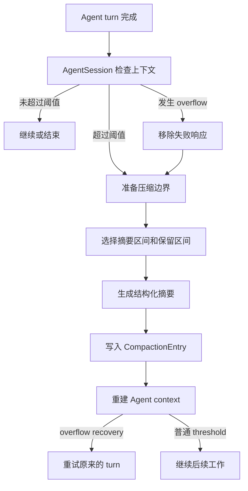
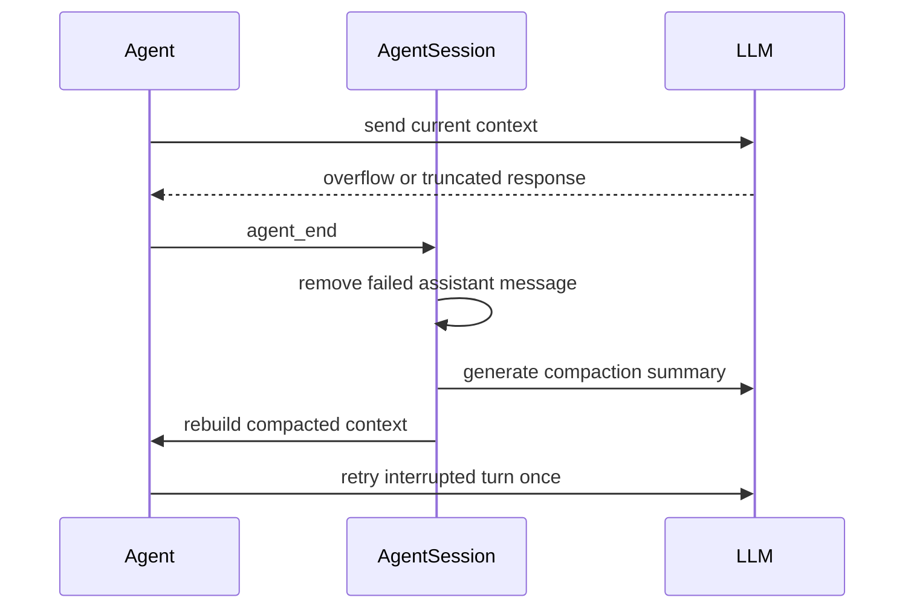

LLM 的 context window 有大小限制。对话、工具调用和工具输出不断累积以后，pi 不能继续把整段历史原样发送给模型，于是需要把旧内容压缩成摘要，同时保留最近的工作。

pi 的 compaction 可以先用三个问题理解。

- 什么时候触发
- 哪些内容被摘要，哪些内容被保留
- 摘要完成以后，Agent 怎样继续运行

本文参考 [pi 的 Compaction 官方文档](https://pi.dev/docs/latest/compaction)，对应实现位于 [`compaction.ts`](https://github.com/earendil-works/pi/blob/main/packages/coding-agent/src/core/compaction/compaction.ts) 和 [`agent-session.ts`](https://github.com/earendil-works/pi/blob/main/packages/coding-agent/src/core/agent-session.ts)。

## 一次 compaction 的路径



compaction 不会删除旧的 session entry。pi 会追加一个 `CompactionEntry`，之后构建上下文时用它代表旧历史，再接上仍然保留的消息。

## 什么时候触发

自动 compaction 的判断是

```text
contextTokens > contextWindow - reserveTokens
```

默认值是

```text
reserveTokens    = 16384
keepRecentTokens = 20000
```

`reserveTokens` 给模型响应预留空间。假设 context window 是 128k，当前上下文超过 128k 减去 16k，也就是 112k，pi 就会考虑压缩。`keepRecentTokens` 决定压缩后大致保留多少最近内容。

用户也可以用 `/compact` 手动触发。手动压缩会先中止当前 Agent 操作，然后生成摘要，不会自动恢复被中止的 turn。

配置位于 `~/.pi/agent/settings.json` 或项目的 `.pi/settings.json`。

```json
{
  "compaction": {
    "enabled": true,
    "reserveTokens": 16384,
    "keepRecentTokens": 20000
  }
}
```

## pi 怎样估算上下文大小

如果最近一次 assistant response 带有有效的 usage，pi 会使用 provider 报告的 token 数，再估算这条响应之后新增的消息。

如果没有可用 usage，pi 会估算消息大小。文本大致按字符数除以 4，图片按固定字符预算计算，assistant 的 thinking、文本和 tool call 也会纳入估算。

这样即使 provider 返回错误，或者 usage 是 0，pi 仍然可以根据消息历史判断是否需要压缩，不会因为一次异常响应把上下文计数清零。

## 压缩哪些内容

pi 会在当前 session branch 上准备一份压缩计划。

```text
prepareCompaction(pathEntries, settings)
  → 找到上一次 compaction 的保留边界
  → 估算当前 context tokens
  → 从最新消息向前寻找 cut point
  → 得到 messagesToSummarize
  → 得到 firstKeptEntryId
```

`firstKeptEntryId` 是压缩后第一个保留 entry 的 ID。之后重建上下文时，pi 会从这个 entry 开始恢复消息。

正常情况下，pi 尽量在 turn 边界切开历史。一个 turn 从 user message 开始，包含后面的 assistant 响应和工具调用，直到下一个 user message。

有效切点可以落在 user、assistant、bashExecution 或 custom message 上。pi 不会在 tool result 上切断，因为 tool result 必须和对应的 tool call 保持完整关系。

```text
原始历史
  [旧消息 旧消息 旧消息] [最近消息 最近消息]
          ↓ 摘要              ↓ 保留

压缩后 context
  [CompactionEntry 摘要] [最近消息 最近消息]
```

旧消息仍然留在 session 文件中，下一次发给 LLM 的 context 使用摘要和保留消息。

## Split turn

有时单个 turn 自己就超过了 `keepRecentTokens`。这时找不到完整的 turn 边界，只能在当前 turn 中间切开。

```text
一个很大的 turn
  user → assistant → tool → assistant → tool → assistant → tool
                         ↑                  ↑
                    早期部分            最近部分
```

pi 会把当前 turn 的早期部分作为 `turnPrefixMessages`，并生成两部分摘要。

```text
历史摘要
  + 当前 turn 前缀摘要
  + 当前 turn 最近消息
```

这样最近保留的 assistant 和 tool 内容仍然有上下文，模型不会只看见后半段结果。

## 摘要怎样生成

pi 先用 `serializeConversation()` 把消息转成带标记的文本，再交给摘要模型。

```text
[User]: 用户消息

[Assistant thinking]: 推理内容

[Assistant]: 回复文本

[Assistant tool calls]: read(path="src/index.ts")

[Tool result]: 工具输出
```

摘要请求会要求模型只生成结构化摘要，不要继续回答原对话里的问题。默认摘要包含目标、约束、进度、关键决策、下一步和继续工作所需的上下文。

工具结果在序列化时最多保留 2000 个字符。`read` 和 `bash` 的输出可能很长，先截断再摘要可以控制 compaction 请求本身的大小。

pi 还会从被摘要消息里的 tool call 提取文件操作，把读过和修改过的文件写入摘要的 details。

```text
read  → readFiles
write → modifiedFiles
edit  → modifiedFiles
```

这些列表会在后续 compaction 中继续累积，让模型知道过去处理过哪些文件。

## CompactionEntry 怎样重建 context

一个 compaction entry 主要包含

```text
type: "compaction"
summary: string
firstKeptEntryId: string
tokensBefore: number
usage?: Usage
details?: unknown
```

session manager 构建当前上下文时，会找到最新的 compaction entry，然后生成

```text
system prompt
  + compaction summary
  + firstKeptEntryId 开始的保留消息
  + compaction entry 之后的新消息
```

被摘要的旧消息没有从 session 历史删除。它们只是不会再次进入默认的 LLM context。

## Context overflow 怎样恢复

阈值 compaction 发生在请求前或一次正常响应之后。overflow recovery 则处理已经发生的请求失败或响应截断。



pi 会把失败或被截断的 assistant message 从 Agent 的实时状态中移除，再压缩并重试原 turn 一次。那条失败消息可能已经写入 session history，但不会进入这次 retry 的 context。

如果重试后又发生同类问题，pi 不会无限重试，会报告 recovery failed，让用户减少上下文或换用更大 context window 的模型。

如果响应已经正常完成，只是 context 超过配置范围，pi 会压缩历史，但不会重新执行刚刚完成的 assistant turn。

## Compaction 失败

摘要生成、鉴权、模型调用或用户中止都可能让 compaction 失败。失败时不会写入半成品的 compaction entry，session 会保留当前历史并发出失败结果。

从状态角度看，compaction 是一次独立的 session 操作。

```text
正常运行
  → 准备压缩
  → 生成摘要
  → 保存摘要 entry
  → 重建 context
  → 继续或 retry

任一步失败
  → 不保存半成品
  → 记录失败
  → 按触发原因决定后续动作
```

## Compaction 和 branch summarization

两者都会生成摘要，但解决的问题不同。

```text
Compaction
  对当前 branch 的旧消息做压缩
  触发方式是 context 接近上限、overflow 或 /compact

Branch summarization
  在 /tree 切换分支时保留被离开分支的上下文
  触发方式是 session tree navigation
```

本文只关注 context window compaction。branch summarization 是 session 分支切换时的另一种摘要流程。

## 读源码时抓住这条线

```text
AgentSession._checkCompaction()
  ↓
shouldCompact() 或 context overflow 判断
  ↓
prepareCompaction()
  ↓
compact()
  ↓
SessionManager.appendCompaction()
  ↓
SessionManager.buildSessionContext()
  ↓
agent.state.messages 重建
  ↓
必要时 agent.continue()
```

真正重要的是 `firstKeptEntryId`。它把摘要和原始 session tree 接起来，让 pi 可以在不删除历史的情况下，决定哪些内容继续发给模型。

## 小结

```text
接近上限
  → 找到安全切点
  → 摘要旧消息
  → 保存 CompactionEntry
  → 用摘要和最近消息重建 context
  → 必要时重试被 overflow 打断的 turn
```

pi 的 compaction 处理的重点是改变下一次 LLM 请求看到的消息集合。旧对话仍然保留在 session 历史里，Agent context 则通过 compaction entry 获得一个更小、还能继续工作的版本。

## 来源

- [pi Compaction 官方文档](https://pi.dev/docs/latest/compaction)
- [compaction.ts](https://github.com/earendil-works/pi/blob/main/packages/coding-agent/src/core/compaction/compaction.ts)
- [compaction/utils.ts](https://github.com/earendil-works/pi/blob/main/packages/coding-agent/src/core/compaction/utils.ts)
- [AgentSession](https://github.com/earendil-works/pi/blob/main/packages/coding-agent/src/core/agent-session.ts)
- [SessionManager](https://github.com/earendil-works/pi/blob/main/packages/coding-agent/src/core/session-manager.ts)
