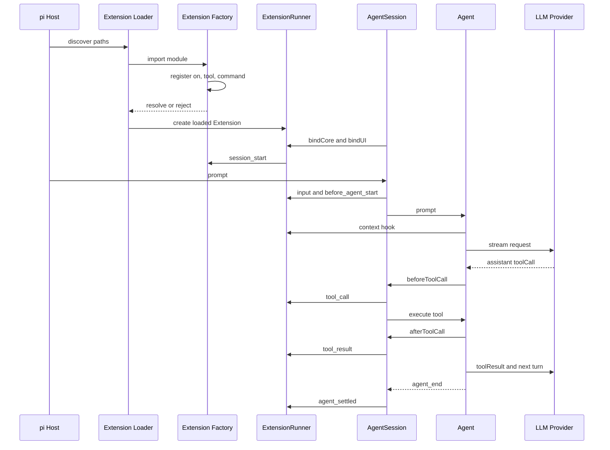

pi 的 Extension API 可以理解成一份运行时协议。extension 通过 default factory 拿到 `ExtensionAPI`，向 pi 声明自己要监听哪些事件、注册哪些工具和命令。pi 再把这些声明收进 `Extension` 对象，由 `ExtensionRunner` 在 AgentSession 的生命周期节点调用。

这套 API 的关键点在于，extension 不需要知道 `Agent` 的内部循环。它只需要遵守几类约定

- 用 factory 完成注册
- 用 `pi.on()` 订阅类型化事件
- 用 `registerTool()`、`registerCommand()` 等方法声明能力
- 在 handler 里通过 `ctx` 调用当前 session 的能力
- 用返回值参与输入、工具结果或会话迁移

相关源码主要集中在 [`extensions/types.ts`](https://github.com/earendil-works/pi/blob/main/packages/coding-agent/src/core/extensions/types.ts)、[`extensions/loader.ts`](https://github.com/earendil-works/pi/blob/main/packages/coding-agent/src/core/extensions/loader.ts) 和 [`extensions/runner.ts`](https://github.com/earendil-works/pi/blob/main/packages/coding-agent/src/core/extensions/runner.ts)。

## 一张图看完整路径



这张图里有两个容易混淆的阶段。factory 阶段只负责声明 extension 的能力，`session_start` 以后才适合启动和当前 session 绑定的后台资源。收到用户请求时，`AgentSession` 才会把 Agent 事件映射成 extension event。

## Extension API 的协议形状

一个最小 extension 是一个 default factory。

```typescript
import type { ExtensionAPI } from "@earendil-works/pi-coding-agent";

export default function (pi: ExtensionAPI) {
  pi.on("session_start", async (_event, ctx) => {
    ctx.ui.notify("Extension loaded", "info");
  });
}
```

协议可以拆成三个对象。

```text
ExtensionFactory
  输入 ExtensionAPI
  输出 void 或 Promise<void>

ExtensionAPI
  注册 handler、tool、command、shortcut、flag
  调用 session action

ExtensionContext
  提供当前 session 的动态上下文和操作
```

`ExtensionFactory` 可以是 async。pi 会等待 factory 完成，再继续启动 session。这个约定适合一次性的初始化，例如从本地服务获取模型列表，再调用 `registerProvider()`。

Extension API 是类型化的。`pi.on("tool_call", handler)` 会把 handler 的 event 类型收窄到 `ToolCallEvent`，`pi.on("session_before_compact", handler)` 则会得到压缩准备信息和取消、定制压缩的返回类型。类型定义集中在 `ExtensionAPI` 的重载里，事件名拼错会在 TypeScript 检查阶段暴露。

## Extension 怎样被发现

pi 有三类入口。

### 标准目录

全局目录是 `~/.pi/agent/extensions/`，项目目录是 `.pi/extensions/`。目录内支持两种简单形式。

```text
extensions/
├── one.ts
└── two/
    └── index.ts
```

直接的 `.ts` 和 `.js` 文件会被发现。子目录会寻找 `index.ts` 或 `index.js`。

### package manifest

更复杂的 extension 可以通过目录里的 `package.json` 声明入口。

```json
{
  "name": "my-pi-extension",
  "pi": {
    "extensions": ["./src/index.ts"]
  }
}
```

loader 会优先读取这个 manifest 的 `pi.extensions`，再解析声明的文件。这样一个 package 可以把入口放在 `src`，同时保留自己的依赖和辅助模块。

### 显式路径

命令行可以用 `-e` 或 `--extension` 传入文件、目录或 package 路径。

```bash
pi -e ./my-extension.ts
```

`discoverAndLoadExtensions()` 会把项目本地目录、全局目录和显式路径合并，并用 resolved path 去重。源码里没有继续递归整个目录树，复杂 package 需要依赖 manifest 明确声明入口。

项目本地 extension 还受到 project trust 保护。在信任决定完成以前，pi 只加载能够参与 `project_trust` 的用户级、全局和命令行 extension。项目本地 `.pi` 内容在信任通过后才进入正常加载流程。这一层是加载安全边界，不代表已经加载的 extension 会被沙箱隔离。

## Loader 怎样把模块变成 Extension

loader 使用 jiti 加载 TypeScript 或 JavaScript 模块，要求模块导出有效的 factory。每个模块加载时会创建一个内部 `Extension` 对象。

```text
Extension
  path
  resolvedPath
  sourceInfo
  handlers
  tools
  commands
  flags
  shortcuts
  messageRenderers
  entryRenderers
```

factory 调用的每个注册方法，最后都会写入这个对象。

```text
factory(pi)
  pi.on(...)              → extension.handlers
  pi.registerTool(...)    → extension.tools
  pi.registerCommand(...) → extension.commands
  pi.registerFlag(...)    → extension.flags
  pi.registerShortcut(...)→ extension.shortcuts
```

注册方法背后还有一个 loading 状态。加载期间，provider 注册、flag 默认值和 EventBus 订阅可能先暂存。factory 成功时执行 `commit()`，extension 进入 active 状态。factory 抛错时执行 `discard()`，暂存注册会被清理，extension 不会进入运行时列表。

可以把这段逻辑写成下面的伪代码。

```text
function loadExtension(path):
    module = import(path)
    factory = resolveDefaultFactory(module)
    extension = createExtension(path)
    api = createExtensionAPI(extension, runtime)

    try:
        await factory(api)
        commitPendingRegistrations()
        return extension
    catch error:
        discardPendingRegistrations()
        recordDiagnostic(path, error)
        return null
```

## Runner 怎样和 kernel 连接

`ExtensionRunner` 是 extension 和 `AgentSession` 之间的调度器。它同时持有已经加载的 extensions、共享 runtime、UI context、session action 和 model registry。

创建 session 时，大致会经过下面的绑定过程。

```text
createAgentSession()
  ↓
创建 Agent
  ↓
创建 AgentSession
  ↓
resourceLoader.getExtensions()
  ↓
new ExtensionRunner(extensions, runtime, ...)
  ↓
runner.bindCore(actions, contextActions)
  ↓
runner.bindUI(uiContext, mode)
  ↓
session_start
  ↓
resources_discover
```

`bindCore()` 把宿主提供的函数交给 runner，例如发送消息、切换模型、修改 active tools、compact、abort、创建 session 和 reload。extension 看到的是 `ctx` 上的接口，实际执行仍回到 `AgentSession`。

```text
extension ctx.sendUserMessage()
  → runtime.sendUserMessage
  → AgentSession.sendUserMessage()
  → AgentSession.prompt()
```

这让 Extension API 保持稳定。extension 不需要持有 `AgentSession` 私有字段，也不能绕开 session 对队列、持久化和状态迁移的控制。

## 事件订阅怎样调用

`pi.on()` 做的事情很简单，它把 handler 按事件名放进 `extension.handlers`。

```typescript
pi.on("turn_start", async (event, ctx) => {
  ctx.ui.setStatus("my-extension", `turn ${event.turnIndex}`);
});
```

事件到达时，runner 按 extension 加载顺序遍历，再按同一 extension 内的注册顺序遍历。

```text
for extension in extensions:
    for handler in extension.handlers[event.type]:
        await handler(event, ctx)
```

handler 是串行调用的。对 `context`、`input`、`message_end` 和 `tool_result` 这类可变事件，前一个 handler 的返回结果会成为后一个 handler 的输入。

```text
extension A
  context handler → messages A
        ↓
extension B
  context handler → messages B
        ↓
Agent
  使用 messages B 请求模型
```

普通通知事件没有 replacement 语义。它们适合更新 UI、写日志和记录指标。handler 的返回值不会改变 Agent 状态。

## Hook 怎样改变主流程

### input

`input` 在 prompt 进入 Agent 以前触发。handler 可以继续处理、改写文本和图片，或者返回 handled 直接结束这次输入。

```typescript
pi.on("input", async (event) => {
  if (event.text.startsWith("/internal")) {
    return { action: "handled" };
  }

  return {
    action: "transform",
    text: event.text.trim(),
    images: event.images,
  };
});
```

### before_agent_start

这个 hook 可以追加 custom message 或替换本轮 system prompt。它运行在 skill、template 展开完成以后，Agent 开始以前。

```typescript
pi.on("before_agent_start", async (_event, _ctx) => {
  return {
    message: {
      customType: "request-metadata",
      content: [{ type: "text", text: "source: internal" }],
      display: false,
      details: {},
    },
  };
});
```

### context

`context` 在每次 provider 请求前触发。它可以裁剪消息、增加临时上下文或改变发给模型的消息列表。pi 会先复制消息，再将前一个 handler 返回的结果传给下一个 handler。

### message_end

`message_end` 可以替换最终消息，但 replacement 必须保持原来的 role。这个约束很重要，因为 Agent 后面的逻辑会根据 user、assistant 和 toolResult 区分消息用途。

### tool_call 和 tool_result

这两个 hook 是工具权限和结果处理最常用的入口。

```typescript
pi.on("tool_call", async (event, ctx) => {
  if (event.toolName === "bash" && event.input.command.includes("rm -rf")) {
    const allowed = await ctx.ui.confirm("Confirm", event.input.command);
    if (!allowed) {
      return { block: true, reason: "Blocked by user" };
    }
  }
});

pi.on("tool_result", async (event) => {
  return {
    content: event.content.filter((part) => part.type !== "image"),
  };
});
```

`tool_call` 发生在工具执行以前，可以阻止执行，也可以原地修改 `event.input`。`tool_result` 发生在工具执行以后，可以改写内容、details、错误标记和 usage。

## Tool registration 的完整路径

注册一个 tool 不等于立刻把它传给模型。它要经过 registry、wrapper 和当前 active tools 筛选。


wrapper 的作用是给 extension tool 补上当前 runner context。工具执行时可以使用 `ctx` 做 UI 交互、访问 session manager 或发送消息。内置工具也会经过 AgentSession 安装的 `beforeToolCall` 和 `afterToolCall`，因此权限控制可以放在统一 hook 上。

一个简化的 tool 注册例子如下。

```typescript
import { Type } from "typebox";

pi.registerTool({
  name: "greet",
  label: "Greet",
  description: "Greet someone by name",
  parameters: Type.Object({ name: Type.String() }),
  async execute(_toolCallId, params) {
    return {
      content: [{ type: "text", text: `Hello, ${params.name}!` }],
      details: {},
    };
  },
});
```

tool 的参数 schema 会成为 provider 的 tool schema。模型返回同名 `toolCall` 后，pi 才会找到注册项、校验参数、运行 execute，并把返回值包装成 `toolResult`。

## Command、Shortcut 和 Flag 的路径

这些能力也遵守同一种注册模型，但触发来源不同。

```text
registerCommand
  → command registry
  → 用户输入 /name
  → handler(args, ctx)

registerShortcut
  → shortcut registry
  → TUI key event
  → handler(ctx)

registerFlag
  → flag registry
  → CLI argument parsing
  → pi.getFlag(name)
```

command 的 handler 拿到的是 `ExtensionCommandContext`，它比普通 `ExtensionContext` 多了等待空闲、new session、fork、tree navigation 和 reload 等操作。shortcut 和 flag 则分别接到 TUI 与 CLI 的生命周期。

## Session replacement 和 context 失效

extension 的 context 是绑定在当前 runner 上的。执行 `/new`、`/resume`、`/fork` 或 `/reload` 时，pi 会先发送 `session_shutdown`，再让旧 runner 失效，最后创建新的 runner 和 context。

```text
old session
  ↓ session_shutdown
old runner.invalidate()
  ↓
new session runtime
  ↓
new runner
  ↓ session_start
new context
```

因此，extension 不应把旧的 `ctx` 保存到跨 session 的异步任务里。需要在新 session 中继续工作时，应当在新的 `session_start` 中重新初始化资源。后台进程、socket、watcher 和 timer 也应当在 `session_start` 或相关 handler 中启动，并在 `session_shutdown` 中关闭。

## 一份可以运行的最小 extension

下面的例子同时展示事件、工具和命令三类入口。

```typescript
import type { ExtensionAPI } from "@earendil-works/pi-coding-agent";
import { Type } from "typebox";

export default function (pi: ExtensionAPI) {
  pi.on("session_start", async (_event, ctx) => {
    ctx.ui.setStatus("demo", "ready");
  });

  pi.on("tool_call", async (event) => {
    if (event.toolName === "bash" && event.input.command.includes("sudo")) {
      return { block: true, reason: "sudo requires a separate approval flow" };
    }
  });

  pi.registerTool({
    name: "project_status",
    label: "Project status",
    description: "Return a short project status",
    parameters: Type.Object({}),
    async execute() {
      return {
        content: [{ type: "text", text: "The project is ready." }],
        details: {},
      };
    },
  });

  pi.registerCommand("status", {
    description: "Show extension status",
    handler: async (_args, ctx) => {
      ctx.ui.notify("Extension is active", "info");
    },
  });
}
```

这个文件被加载以后，tool 是否真的可用还取决于当前 active tool 配置。command 是否可见取决于 extension 是否成功加载，以及当前运行模式是否提供 command context。注册成功只是声明完成，实际执行仍受 session、权限和模式限制。

## 最后看设计边界

pi 的 Extension API 有一条清楚的分层边界。

```text
ExtensionAPI
  负责声明能力和订阅事件

ExtensionRunner
  负责保存注册结果和按顺序调用 handler

AgentSession
  负责把事件接到 session、Agent、持久化和 UI

Agent
  负责模型响应、工具执行和下一轮循环
```

这套设计带来几个直接结果。

- extension 可以参与主流程，但不需要复制 Agent loop
- hook 可以在确定的边界上改写输入、上下文、消息和工具结果
- 观察型 event 不会和数据变换型 hook 混在一起
- runner 可以在 session reload 后整体替换
- context 的失效机制阻止旧 extension 写入新 session
- EventBus 可以做 extension 之间的通信，但不会冒充 kernel lifecycle

如果只想记录发生了什么，订阅 `agent_start`、`turn_end` 或 `agent_settled`。如果需要改写数据，使用 `input`、`context`、`message_end` 或 `tool_result`。如果需要阻止动作，使用 `tool_call` 或 `session_before_*`。如果需要让模型能够调用新能力，使用 `registerTool()`。

这就是 pi Extension API 的基本协议。extension 负责声明，loader 负责发现，runner 负责调度，session 负责接线，Agent 负责执行。

## 来源

- [Extension API 类型定义](https://github.com/earendil-works/pi/blob/main/packages/coding-agent/src/core/extensions/types.ts)
- [Extension loader 源码](https://github.com/earendil-works/pi/blob/main/packages/coding-agent/src/core/extensions/loader.ts)
- [ExtensionRunner 源码](https://github.com/earendil-works/pi/blob/main/packages/coding-agent/src/core/extensions/runner.ts)
- [AgentSession 源码](https://github.com/earendil-works/pi/blob/main/packages/coding-agent/src/core/agent-session.ts)
- [Extension 使用文档](https://github.com/earendil-works/pi/blob/main/packages/coding-agent/docs/extensions.md)
- [EventBus 源码](https://github.com/earendil-works/pi/blob/main/packages/coding-agent/src/core/event-bus.ts)
