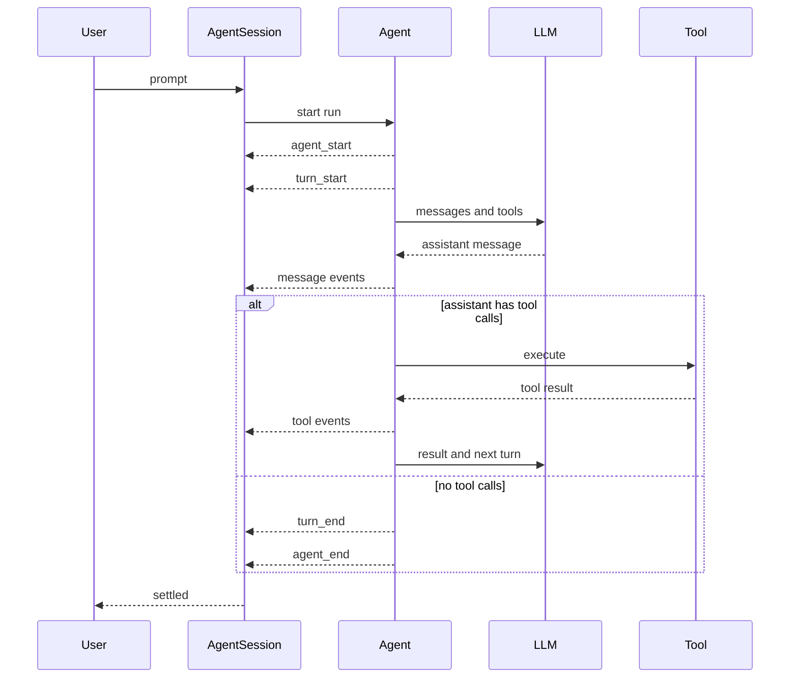

这篇只看三个对象。`Agent`、`AgentSession` 和 event。它们分别对应 pi 的一次任务怎样运行、怎样保存，以及怎样把运行过程传给 UI 和其他消费者。

核心源码是 [`packages/agent/src/agent-loop.ts`](https://github.com/earendil-works/pi/blob/main/packages/agent/src/agent-loop.ts) 和 [`packages/coding-agent/src/core/agent-session.ts`](https://github.com/earendil-works/pi/blob/main/packages/coding-agent/src/core/agent-session.ts)。事件类型可以在 [`packages/coding-agent/src/core/extensions/types.ts`](https://github.com/earendil-works/pi/blob/main/packages/coding-agent/src/core/extensions/types.ts) 看到。

## 一次请求的生命周期



`Agent` 和 `AgentSession` 不是同一个层次。`Agent` 负责把当前任务继续跑下去，`AgentSession` 负责把这次运行放进一个可恢复的会话里。

## Agent 做什么

`Agent` 位于 `packages/agent`。它维护模型上下文、消息列表、工具列表和当前运行配置，核心循环可以压缩成下面这样。

```text
while true:
    assistant = stream LLM response
    append assistant to context

    if assistant stopped with error or abort:
        end run

    toolCalls = assistant.toolCalls

    if toolCalls is empty:
        if followUpMessages exist:
            append follow-up messages
            continue
        end run

    results = execute toolCalls
    append results to context
    continue next turn
```

它处理的是一次 Agent run 的基本过程。

- 调用模型并接收流式 assistant message
- 识别 assistant message 里的 tool call
- 执行工具并生成 tool result
- 把 tool result 放回消息上下文
- 决定是否进入下一轮
- 处理中断、错误和排队消息

`Agent` 不负责 session 文件，也不负责把消息写入磁盘。它只保证当前 run 的消息和轮次能够继续推进。

## AgentSession 做什么

`AgentSession` 位于 `packages/coding-agent`，它在 `Agent` 外面增加了会话状态。

```text
AgentSession
  ├─ owns Agent
  ├─ owns SessionManager
  ├─ subscribes to Agent events
  ├─ persists completed messages
  ├─ handles retry and compaction
  └─ exposes session events
```

它主要承接五类工作。

第一，`message_end` 到来时，把完整的 user、assistant 和 tool result 消息交给 `SessionManager`，支持进程重启后的会话恢复。

第二，`agent_end` 以后，检查自动重试、上下文压缩和排队消息。全部处理完成后，session 才进入 settled 状态。

第三，新建、恢复、分叉和 reload 时，结束旧 session 并创建新的运行对象。新的 Agent 会从新的 session context 开始。

第四，每次请求模型以前，重新准备 system prompt、消息和工具列表。上下文过长时，session 先做 compaction。

第五，把 Agent event 转成 session 层可以订阅的事件，让 UI 不必直接依赖 Agent 的内部对象。

## Event 怎么定义

低层 Agent 产生一组描述运行过程的 `AgentEvent`。

```text
agent_start
turn_start
message_start
message_update
message_end
tool_execution_start
tool_execution_update
tool_execution_end
turn_end
agent_end
```

可以按用途分成三组。

### 运行边界

`agent_start` 表示一次 run 开始，`turn_start` 表示一次模型轮次开始，`turn_end` 表示这一轮的 assistant 响应和工具结果已经处理完，`agent_end` 表示低层循环不再发起下一轮。

### 消息过程

`message_start` 和 `message_end` 标记一条消息的边界。assistant 流式输出期间会不断产生 `message_update`，适合实时显示文本和 thinking 内容。`message_end` 才是可以保存和继续处理的完整消息。

### 工具过程

`tool_execution_start`、`tool_execution_update` 和 `tool_execution_end` 描述工具执行。工具结束后，Agent 会把结果包装成 `toolResult` 消息，再决定是否请求模型下一轮。

## Event 怎么流转

`AgentSession` 在构造时订阅 `Agent`。每个 Agent event 到来后，主路径大致如下。

```text
Agent emits event
  ↓
AgentSession._handleAgentEvent
  ↓
session event listeners
  ↓
message_end 时写入 SessionManager
  ↓
继续当前 turn，或执行 post-run work
```

带工具调用的请求可以展开成下面的顺序。

```text
agent_start
  ↓
turn_start
  ↓
assistant message_start
assistant message_update ...
assistant message_end
  ↓
tool_execution_start
tool_execution_update ...
tool_execution_end
  ↓
toolResult message_start
toolResult message_end
  ↓
turn_end
  ↓
turn_start
  ↓
下一条 assistant message
```

如果下一条 assistant message 没有工具调用，当前 run 会在 `turn_end` 后发出 `agent_end`。如果 session 仍有重试、压缩或排队消息，`agent_end` 后还会继续处理，最后才发出 `agent_settled`。

## Agent end 和 Agent settled

这两个事件表达的状态不同。

```text
agent_end
  = Agent loop 不再请求模型

agent_settled
  = session 的后续工作也全部结束
```

只想知道模型是否停止输出时，可以看 `agent_end`。要判断当前 session 是否空闲，应当看 `agent_settled`。

## 消息为什么有 start、update 和 end

以 assistant message 为例，流式响应不会等到全部内容到达后才进入状态，而是先放入部分消息，再持续更新，最后替换成完整消息。

```text
stream start
  → partial assistant message
  → text or thinking update
  → tool call update
  → final assistant message
  → message_end
```

这样 UI 可以尽早显示内容，持久化和后续判断则使用 `message_end` 的最终状态。工具结果也遵循相同的消息边界，执行过程可以有 update，会话记录保存的是最终 `toolResult`。

## Session 替换

新建、恢复、分叉或 reload 会切换整套运行对象。

```text
current session
  ↓ abort active run
session_shutdown
  ↓
dispose old session
  ↓
create new Agent and AgentSession
  ↓
restore or create session context
  ↓
session_start
  ↓
new session becomes active
```

旧 session 的事件订阅、运行状态和上下文不会继续带到新 session。恢复会话时，消息从 session 存储重新构建，再交给新的 `Agent`。

## 读源码时抓住这条线

```text
Agent.prompt()
  ↓
agent-loop.runLoop()
  ↓
streamAssistantResponse()
  ↓
executeToolCalls()
  ↓
AgentSession._handleAgentEvent()
  ↓
SessionManager persistence
  ↓
retry / compaction / continuation
  ↓
agent_settled
```

这条线已经覆盖 pi 一次 Agent 运行的大部分关键行为。先把这条线读懂，再去看其他扩展能力，会容易很多。

## 小结

```text
Agent 负责运行
AgentSession 负责承接运行
Event 负责传递过程和边界
```

`Agent` 让模型、工具和消息形成连续轮次。`AgentSession` 把这些轮次变成可以保存、恢复、重试和压缩的会话。事件则把开始、更新、完成和 settled 状态暴露出来。

## 来源

- [Agent loop 源码](https://github.com/earendil-works/pi/blob/main/packages/agent/src/agent-loop.ts)
- [AgentSession 源码](https://github.com/earendil-works/pi/blob/main/packages/coding-agent/src/core/agent-session.ts)
- [Agent 与 session 事件类型](https://github.com/earendil-works/pi/blob/main/packages/coding-agent/src/core/extensions/types.ts)
