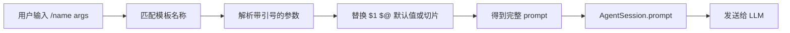

pi 的自定义 prompt template 是一段可以重复使用的 Markdown prompt。它放在指定目录里，文件名会变成一个 slash command。输入 `/review`，pi 找到 `review.md`，替换参数，然后把文件内容当成这次请求的完整 prompt。

官方文档是 [Prompt Templates](https://pi.dev/docs/latest/prompt-templates)，本地实现主要在 [`prompt-templates.ts`](https://github.com/earendil-works/pi/blob/main/packages/coding-agent/src/core/prompt-templates.ts)。

## 最小用法

创建 `~/.pi/agent/prompts/review.md`。

```markdown
---
description: Review staged git changes
---

Review the staged changes in `git diff --cached`.
Focus on:

- Bugs and logic errors
- Security issues
- Error handling gaps
```

启动 pi 后，在输入框里输入 `/review`，自动补全会显示这个模板。提交以后，模型收到的是 Markdown 文件正文，不是 `/review` 这几个字符。

模板的命令名来自文件名。

```text
review.md       → /review
write-chapter.md → /write-chapter
```

`description` 是可选的。没有填写时，pi 会取正文的第一行非空内容作为描述，并截断过长文本。

## 模板从哪里加载

pi 会从几类位置寻找 Markdown prompt。

```text
全局
  ~/.pi/agent/prompts/*.md

项目
  .pi/prompts/*.md

package
  prompts/ 目录
  package.json 中的 pi.prompts

settings
  prompts 数组指定的文件或目录

CLI
  --prompt-template <path>
```

项目目录里的模板只会在项目通过 trust 检查后加载。命令行可以重复传入 `--prompt-template`，适合临时试用一个模板。

```bash
pi --prompt-template ./prompts/write.md
```

目录扫描是非递归的。`prompts/one.md` 可以直接发现，`prompts/book/chapter.md` 不会因为放在更深目录里自动出现。需要子目录时，可以显式把目录加入 settings，或者通过 package manifest 声明资源。

如果不同来源有同名模板，pi 会记录 collision diagnostic，并保留先加载的模板。实际使用前可以在启动信息或配置界面检查来源，避免 `/review` 指向了错误文件。

## 一次命令怎样变成 prompt



在 `AgentSession.prompt()` 中，pi 会先处理 slash command，再展开 skill 和 prompt template，最后把展开后的文本包装成 user message。

```text
输入
  /component Button "click handler"

找到
  component.md

展开
  Create a component named $1 with features: $@

结果
  Create a component named Button with features: click handler
```

模板展开只发生在输入完全符合 `/name optional-args` 这种形式时。普通文本、包含多余结构的输入和不存在的模板名会原样保留。

## 参数替换

pi 的参数语法比较小，但够覆盖常见场景。

| 写法 | 含义 |
|---|---|
| `$1`、`$2` | 第一个、第二个位置参数 |
| `$@` | 所有参数，用空格连接 |
| `$ARGUMENTS` | 所有参数，用空格连接 |
| `${1:-default}` | 第一个参数为空时使用默认值 |
| `${@:-default}` | 所有参数为空时使用默认值 |
| `${@:N}` | 从第 N 个参数开始取到末尾 |
| `${@:N:L}` | 从第 N 个参数开始取 L 个参数 |

例如 `component.md` 可以这样写。

```markdown
---
description: Create a component
argument-hint: "<name> [features]"
---

Create a React component named `$1`.
Required features: `$@`.
```

调用方式如下。

```text
/component Button "onClick handler" "disabled support"
```

展开后的 prompt 会得到 `Button`、`onClick handler` 和 `disabled support`。参数里的引号只用于分组，解析后不会保留引号。

## 默认值和参数切片

默认值适合让一个模板既能单独运行，也能接受更具体的要求。

```markdown
Summarize the current state in ${1:-7} bullet points.
```

```text
/summarize
  → Summarize the current state in 7 bullet points.

/summarize 3
  → Summarize the current state in 3 bullet points.
```

参数切片适合把第一个参数当作名称，把剩余参数当作说明。

```markdown
Component name: $1
Additional requirements: ${@:2}
```

```text
/component Button "keyboard support" "loading state"
```

其中 `${@:2}` 会得到 `keyboard support loading state`。`${@:2:1}` 则只取从第二个参数开始的一个参数。

## 引号怎样解析

pi 自己提供了一个简单的命令参数解析器。它按空白切分参数，单引号和双引号可以把包含空格的内容放在同一个参数里。

```text
/review "focus on auth and error handling"
```

模板收到一个参数。

```text
focus on auth and error handling
```

它适合 slash command 的常用输入，不是完整的 shell parser。模板设计时，把复杂内容放在文件正文里，把参数用于名称、范围、数量和少量补充说明，通常更容易维护。

## description 和 argument-hint

这两个 frontmatter 字段只影响发现和使用体验，不会自动进入发给模型的正文。

```markdown
---
description: Review a pull request
argument-hint: "<PR-URL> [focus]"
---
```

输入 `/` 后，自动补全可以显示命令名、参数提示和描述。

```text
→ review <PR-URL> [focus] — Review a pull request
```

`argument-hint` 使用尖括号表示必填参数，方括号表示可选参数。这只是 UI 提示，pi 不会因为缺少必填参数而阻止展开。需要参数校验时，应当在 prompt 正文里明确要求模型检查，或者把更严格的输入处理放到其他机制中。

## Prompt Template 和普通 prompt

两者最终都会变成 user message，区别在于内容从哪里来。

```text
普通 prompt
  用户每次手写

Prompt Template
  文件保存固定指令
  调用时只补参数
```

这使模板适合保存重复的工作流程，例如代码 review、生成测试、整理会议记录、写章节大纲或做一次固定格式的研究。

模板正文仍然会占用 context。一个几千字的模板每次调用都会进入请求，因此模板应该把固定要求写清楚，但不要把和当前任务无关的背景长期塞进去。

## 和 Skill 的区别

Prompt Template 是主动调用的 prompt 片段。用户输入 `/name` 后，它立即展开并提交。

Skill 更像一份按任务加载的能力说明，可以包含何时使用、需要遵守的步骤和相关资源。模板解决的是“我想用这段固定 prompt”，Skill 解决的是“处理这类任务时，需要加载哪些方法和资料”。两者都可以被 slash command 触发，但它们在资源类型和加载方式上不同。

## 不同调用方式的一个细节

交互式输入通常会自动展开 prompt template。程序调用 `AgentSession.prompt()` 时也默认开启展开，可以用 `expandPromptTemplates: false` 关闭。

```typescript
await session.prompt("/review");

await session.prompt("/review", {
  expandPromptTemplates: false,
});
```

`steer()` 和 `followUp()` 会先展开模板，再把展开后的消息排进当前 Agent 的队列。更底层的 `sendUserMessage()` 默认不展开模板，调用方需要显式传入 `expandPromptTemplates: true`。

```typescript
await session.sendUserMessage("/review", {
  expandPromptTemplates: true,
});
```

这个差异可以避免程序生成的文本意外触发 slash command，也让上层调用者自己决定是否启用模板语义。

## 一个适合长期使用的模板

模板文件可以按一个明确的工作结果来设计。

```markdown
---
description: Turn notes into a chapter outline
argument-hint: "[topic]"
---

Create an outline for ${1:-the current topic}.

Return:

1. The central question
2. Five to seven sections
3. The purpose of each section
4. Facts that still need verification
5. A short list of open questions

Do not write the full chapter yet.
```

调用时可以只写 `/outline`，也可以写 `/outline context window compaction`。模板负责固定输出形状，参数负责指定当前对象。

## 读源码时抓住这条线

```text
loadPromptTemplates()
  ↓
PromptTemplate[]
  ↓
AgentSession.prompt()
  ↓
expandPromptTemplate()
  ↓
parseCommandArgs()
  ↓
substituteArgs()
  ↓
user message
  ↓
LLM
```

这里没有额外的 prompt agent，也没有单独的模型调用。模板只是发生在请求前的一次本地文本展开，展开结果随后按普通用户消息进入 Agent loop。

## 小结

pi 的自定义 prompt template 可以压缩成一句话。

```text
Markdown 文件
  → 文件名成为 /command
  → 调用时替换参数
  → 展开成 user prompt
  → 进入普通 Agent loop
```

它最适合固定流程、固定输出格式和少量动态输入。把重复要求写进文件，把每次变化的对象留给参数，模板就能成为一组轻量、可复用的个人工作命令。

## 来源

- [Prompt Templates 官方文档](https://pi.dev/docs/latest/prompt-templates)
- [prompt-templates.ts](https://github.com/earendil-works/pi/blob/main/packages/coding-agent/src/core/prompt-templates.ts)
- [AgentSession.prompt()](https://github.com/earendil-works/pi/blob/main/packages/coding-agent/src/core/agent-session.ts)
- [Pi coding-agent 文档](https://github.com/earendil-works/pi/tree/main/packages/coding-agent/docs)
