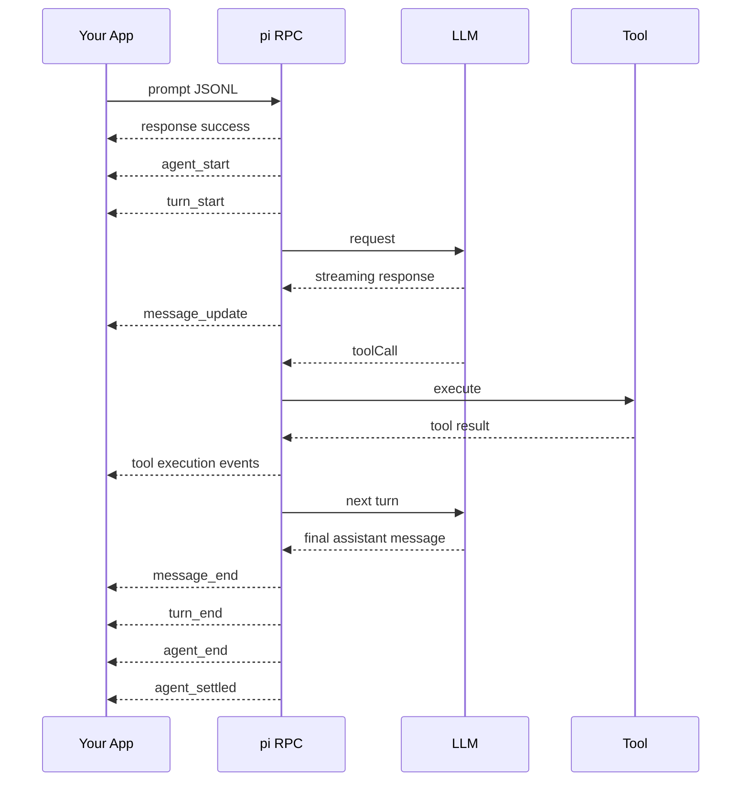

pi 的 RPC Mode 适合这样一种场景。你已经有一个外部流程，想把 pi 当成一个可以启动、发送任务、持续接收事件、最后拿到结果的 Agent 服务。

它不要求你的应用接触 pi 的内部 TypeScript 对象。你的程序启动一个 `pi --mode rpc` 子进程，通过 stdin 写 JSON，通过 stdout 读 JSON。这样脚本、IDE、Web 服务和其他语言都可以接入。

官方文档是 [RPC Mode](https://pi.dev/docs/latest/rpc)。实现主要在 [`rpc-mode.ts`](https://github.com/earendil-works/pi/blob/main/packages/coding-agent/src/modes/rpc/rpc-mode.ts)、[`rpc-types.ts`](https://github.com/earendil-works/pi/blob/main/packages/coding-agent/src/modes/rpc/rpc-types.ts) 和 [`rpc-client.ts`](https://github.com/earendil-works/pi/blob/main/packages/coding-agent/src/modes/rpc/rpc-client.ts)。

## RPC Mode 适合什么

RPC Mode 的价值在于把 pi 变成一个外部可编排的进程。

```text
你的流程
  → 启动 pi
  → 发送 prompt
  → 接收流式文本和工具事件
  → 等待任务结束
  → 读取结果或发送下一条命令
```

常见使用方式包括

- 在 IDE 里嵌入一个自定义 Agent 面板
- 在后端服务里把 pi 接成代码处理 worker
- 用 Python、Go 或 Rust 调用 pi
- 用脚本批量处理文件和项目任务
- 把用户输入、模型响应和审批流程放在自己的 UI 里

如果调用方本身就是 Node.js 或 TypeScript 应用，官方建议优先直接使用 `AgentSession`。RPC 更适合跨语言、进程隔离和已有 CLI 编排的场景。

## 启动方式

```bash
pi --mode rpc
```

实际使用时通常会同时指定工作目录、provider、model 和 session 选项。

```bash
pi --mode rpc \
  --provider anthropic \
  --model claude-sonnet-4-6 \
  --session-dir /tmp/my-agent-sessions
```

如果不希望保存会话，可以加 `--no-session`。需要跨多次调用保留上下文时，则保留 session，并让 pi 自己管理 session 文件。

## 协议的基本形状

RPC 使用严格的 JSONL。每一行是一个独立 JSON 对象，换行符使用 `\n`。

```text
stdin
  一行一个 command

stdout
  一行一个 response、event 或 extension UI request
```

命令可以带 `id`。pi 会把同一个 `id` 放回 response，外部程序就能把多个并行请求对应起来。

```json
{"id":"req-1","type":"prompt","message":"检查当前项目的测试状态"}
```

命令被接受以后，pi 会返回一条 response。

```json
{"id":"req-1","type":"response","command":"prompt","success":true}
```

这条 response 表示 prompt 已经被接受、排队或立即处理。它不代表模型已经回答完。后续响应会以事件形式继续从 stdout 流出。

## 一次 prompt 的事件流



客户端通常关心四类事件。

```text
message_update
  用于实时显示文本、thinking 和 tool call 的流式变化

message_end
  一条完整消息结束，适合保存最终消息

tool_execution_start / update / end
  用于显示工具执行和进度

agent_settled
  整个 session run 结束，后续不会自动 retry、compact 或处理 queued follow-up
```

`message_update` 里的 `assistantMessageEvent` 是增量事件。客户端需要按 `contentIndex` 组装内容。需要最终结果时，应以 `message_end.message` 为准。

## 最小 Python 客户端

官方文档给出了 Python 的基础写法。下面的例子把 prompt 发给 pi，打印模型文本，并在 Agent 完成后退出。

```python
import json
import subprocess


process = subprocess.Popen(
    ["pi", "--mode", "rpc", "--no-session"],
    stdin=subprocess.PIPE,
    stdout=subprocess.PIPE,
    text=True,
)


def send(command: dict) -> None:
    assert process.stdin is not None
    process.stdin.write(json.dumps(command) + "\n")
    process.stdin.flush()


assert process.stdout is not None
send({
    "id": "req-1",
    "type": "prompt",
    "message": "列出当前项目最重要的三个测试命令",
})

for line in process.stdout:
    event = json.loads(line)
    event_type = event.get("type")

    if event_type == "message_update":
        delta = event.get("assistantMessageEvent", {})
        if delta.get("type") == "text_delta":
            print(delta.get("delta", ""), end="", flush=True)

    if event_type == "agent_settled":
        print()
        break

process.terminate()
```

这里有一个容易写错的地方。收到 `prompt` 的成功 response 后，不能立刻认为任务完成。真正的完成信号是事件流里的 `agent_settled`。

## 一个更实用的集成例子

假设你在做一个文档处理服务。用户上传 Markdown，外部流程负责文件管理，pi 负责分析内容并生成审阅意见。

```text
HTTP 请求
  ↓
服务保存上传文件
  ↓
服务启动 pi RPC 子进程
  ↓
发送 prompt，要求读取文件并输出审阅报告
  ↓
服务把 message_update 转发给前端
  ↓
收到 agent_settled
  ↓
读取最后一条 assistant message
  ↓
保存报告并返回任务结果
```

伪代码如下。

```python
async def review_document(file_path: str):
    agent = await start_pi_rpc(cwd=project_dir)

    await agent.send({
        "id": "review-1",
        "type": "prompt",
        "message": f"读取 {file_path}，检查结构、事实和表达问题，最后给出审阅报告。",
    })

    final_text = ""
    async for event in agent.events():
        if event["type"] == "message_update":
            await publish_to_websocket(event)

        if event["type"] == "agent_settled":
            response = await agent.send({
                "id": "messages-1",
                "type": "get_last_assistant_text",
            })
            final_text = response["data"]["text"] or ""
            break

    await save_review(file_path, final_text)
    await agent.stop()
    return final_text
```

这个架构里，pi 只负责 Agent 任务。鉴权、任务 ID、HTTP 状态、WebSocket 推送、结果存储和失败重试都由外部服务控制。RPC 的边界清楚以后，系统不会把业务状态塞进 prompt 文本里。

## Command response 和 event 要分开处理

RPC 有两种不同的输出。

```text
response
  对某条 command 的接受结果或同步结果

event
  Agent 运行过程中持续发生的状态变化
```

例如 `get_state` 会直接返回当前状态。

```json
{"id":"state-1","type":"get_state"}
```

```json
{
  "id": "state-1",
  "type": "response",
  "command": "get_state",
  "success": true,
  "data": {
    "isStreaming": true,
    "isCompacting": false,
    "sessionId": "abc123",
    "messageCount": 5,
    "pendingMessageCount": 0
  }
}
```

设计客户端时，可以把 command response 交给 request manager，把 event 交给 session event dispatcher。两者不要共用一个等待逻辑。

## 如何等待一个任务完成

不同场景应当选择不同的结束事件。

```text
只想知道低层 Agent 停止
  等待 agent_end

要确保 session 不会继续自动 retry、compact 或 follow-up
  等待 agent_settled
```

一个 prompt 可能触发多轮模型调用，也可能因为工具调用继续运行。等待单个 `message_end` 只能说明一条消息结束，不能说明整个任务完成。

如果用户在任务运行时继续输入，可以使用两种队列语义。

```json
{"type":"prompt","message":"改变方向，先检查错误日志","streamingBehavior":"steer"}
```

`steer` 会在当前 assistant turn 和工具调用结束后进入下一轮。

```json
{"type":"follow_up","message":"任务完成后再生成一份摘要"}
```

`follow_up` 会等 Agent 原本结束以后再处理。

如果正在 streaming，却发送普通 `prompt` 且没有 `streamingBehavior`，pi 会返回失败 response。客户端应当在 UI 上明确区分立即发送、steer 和 follow-up。

## 错误处理

RPC 的错误分为两种。

### 接受前的错误

例如命令 JSON 无法解析、模型不存在、参数不完整或当前状态不允许执行。它们会返回

```json
{
  "type": "response",
  "command": "set_model",
  "success": false,
  "error": "Model not found"
}
```

### 接受后的错误

prompt 已经被接受以后，模型请求失败、工具报错或 Agent 被中止，不会再为同一个 request ID 发送第二条失败 response。客户端需要从事件和最终 assistant message 里处理这些情况。

```text
prompt response success
  ↓
agent_start
  ↓
message events
  ↓
agent_end
  ↓
agent_settled
```

生产客户端至少应当记录 stderr、进程退出码、最后一个 event 和 session ID。pi 的 stdout 是机器协议，调试日志应当放在 stderr 或应用自己的日志系统里。

## Session 和无状态调用

无状态调用适合一次性任务。

```bash
pi --mode rpc --no-session
```

每次启动都是新的上下文，任务完成后即可退出。

需要多轮协作时，应当保留 session。此时 pi 会把消息写入 JSONL session 文件，RPC 客户端可以继续发送新的 prompt，也可以调用 `get_messages`、`get_session_stats` 和 `get_state` 查询当前状态。

```json
{"id":"stats-1","type":"get_session_stats"}
```

统计结果包含 input、output、cache、cost、当前 context usage、消息数量和工具调用数量。这些数据可以直接接到外部任务监控中。

## RPC 和 AgentSession 怎么选

```text
同一个 Node.js / TypeScript 进程
  → 直接使用 AgentSession

Python、Go、Rust 或独立服务
  → 使用 RPC Mode

需要进程隔离
  → 使用 RPC Mode

需要完整类型和内部控制
  → 直接使用 AgentSession

需要把 stdout 当事件流接入已有编排系统
  → 使用 RPC Mode
```

RPC 的代价是多了一个子进程和 JSONL 序列化边界。它还要求客户端正确处理进程退出、背压、事件组装和 UI 请求。对于 Node.js 应用，这些成本通常没有必要；对于跨语言或外部系统集成，它们正是 RPC 的价值所在。

## 实现原理只看三件事

RPC Mode 的实现本身并不复杂。

```text
stdin JSONL reader
  ↓
parse RpcCommand
  ↓
call AgentSession method
  ↓
return RpcResponse

AgentSession.subscribe()
  ↓
toJsonEvent()
  ↓
stdout JSONL writer
```

`rpc-mode.ts` 负责读取命令、调用 session 方法、输出 response 和转发事件。`rpc-types.ts` 定义 command、response 和 event 的 TypeScript union。`rpc-client.ts` 则提供一个可以 spawn pi、管理 request ID 和分发事件的 typed client。

客户端实现 JSONL reader 时要按 `\n` 切记录，并处理结尾的 `\r`。官方文档特别提醒，Node.js 的通用 `readline` 会把 Unicode 行分隔符也当成换行，这不符合 RPC 的严格 JSONL 规则。

## 一个可执行的接入检查表

开始集成前，先确认这些问题。

- pi 进程的 cwd 是否正确
- provider、model 和鉴权是否已经可用
- 是否需要 `--no-session`
- prompt 接受和任务完成是否使用了两套状态处理
- 是否监听 `agent_settled`
- 是否能处理 steer、follow-up 和 abort
- 是否把 stdout 当作纯 JSONL 解析
- 是否记录 stderr 和进程退出
- 如果有自定义 UI，是否实现 extension UI request 和 response

最后一项只在你加载的 extension 需要 UI 时出现。普通的 prompt、tool 和 Agent 事件不需要外部 UI 协议。

## 小结

pi RPC Mode 可以压缩成一条外部集成路径。

```text
启动 pi 子进程
  → stdin 发送 JSON command
  → stdout 接收 response 和 event
  → 用事件驱动自己的 UI 或流程状态
  → 等待 agent_settled
  → 读取结果、保存任务并关闭进程
```

它的重点是提供一个稳定的进程边界和事件协议。你的应用可以掌握任务编排、用户交互和业务状态，pi 则负责 Agent 的模型调用、工具使用和会话运行。

## 来源

- [RPC Mode 官方文档](https://pi.dev/docs/latest/rpc)
- [rpc-mode.ts](https://github.com/earendil-works/pi/blob/main/packages/coding-agent/src/modes/rpc/rpc-mode.ts)
- [rpc-types.ts](https://github.com/earendil-works/pi/blob/main/packages/coding-agent/src/modes/rpc/rpc-types.ts)
- [rpc-client.ts](https://github.com/earendil-works/pi/blob/main/packages/coding-agent/src/modes/rpc/rpc-client.ts)
- [AgentSession](https://github.com/earendil-works/pi/blob/main/packages/coding-agent/src/core/agent-session.ts)
