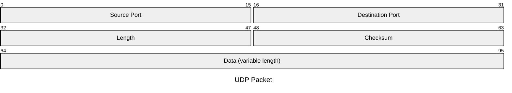

UDP 是 User Datagram Protocol 的缩写。它位于传输层，设计目标很直接：把一段数据交给 IP 层发送，尽量少做额外事情。

它没有 TCP 那样的连接建立、重传和顺序控制。因此，UDP 不是“更快的 TCP”，而是一种把控制权更多交给应用层的传输方式。

## UDP 报文长什么样

UDP 头部固定只有 8 字节，由四个 16 位字段组成。下面用 Mermaid 的 packet diagram 画出报文布局：



- **Source Port**：源端口。IPv4 中可以为 0，表示不使用源端口；通常用于让接收方知道该把响应发回哪里。
- **Destination Port**：目标端口，用来把数据交给接收端的对应应用。
- **Length**：整个 UDP 数据报的长度，包含 8 字节头部和数据，最小值是 8。
- **Checksum**：校验和，用于发现传输过程中的数据损坏。IPv4 中可以不使用，IPv6 中通常必须使用。
- **Data**：应用数据，长度可变。

端口字段是 16 位，因此端口号范围是 0 到 65535。UDP 长度字段也是 16 位，理论上的数据报最大长度是 65535 字节；实际可用大小还会受到 IP 层、链路 MTU 和分片的影响。

## 它为什么叫“无连接”

UDP 发送数据前不需要握手。应用只需要指定目标地址和端口，就可以发出一个 datagram。接收方拿到后，根据目标端口把它交给对应的 socket。

这带来了很小的协议开销，但也意味着 UDP 不保证：

- 数据一定送达；
- 数据按发送顺序到达；
- 数据不会重复到达；
- 发送方一定知道接收方是否处理成功。

丢包、乱序、重复和超时，都可能需要应用层自己处理。如果业务确实需要可靠传输，可以在 UDP 之上增加序列号、确认、重传、拥塞控制等机制。QUIC 就是在 UDP 之上实现可靠传输和加密的一个典型例子。

## UDP 适合什么场景

UDP 适合那些更看重低延迟、简单请求响应，或希望自己控制传输策略的场景，例如：

- DNS、NTP、DHCP 这类短请求或短响应协议；
- 语音、视频和实时游戏；
- 广播、组播和服务发现；
- QUIC 等在应用层实现可靠性和安全性的协议。

实时音视频里，晚到的数据有时已经没有价值。与其等待重传导致画面或声音卡顿，应用可能更愿意丢掉一个过期 datagram，继续处理最新数据。

## 一个工程上的判断

选择 UDP，不等于可以忽略可靠性，而是把“可靠到什么程度”变成一个明确的工程问题：

```text
低延迟比完整性重要？      可以容忍部分丢包
每个字节都必须到达？      增加确认与重传，或直接使用 TCP / QUIC
数据是否允许乱序？        设计序列号和过期策略
网络拥塞时怎么办？        设计发送速率与退避机制
```

我会把 UDP 看成一个很薄的传输边界：它负责端口复用和基础校验，但不替应用做业务判断。越靠近实时性和定制化，越值得考虑 UDP；越接近文件、事务和完整交付，越应该优先考虑带可靠性保证的方案。

## 参考

- [Wikipedia：User Datagram Protocol](https://en.wikipedia.org/wiki/User_Datagram_Protocol)
- [RFC 768：User Datagram Protocol](https://www.rfc-editor.org/rfc/rfc768)
- [Mermaid：Packet Diagram](https://mermaid.js.org/syntax/packet.html)
