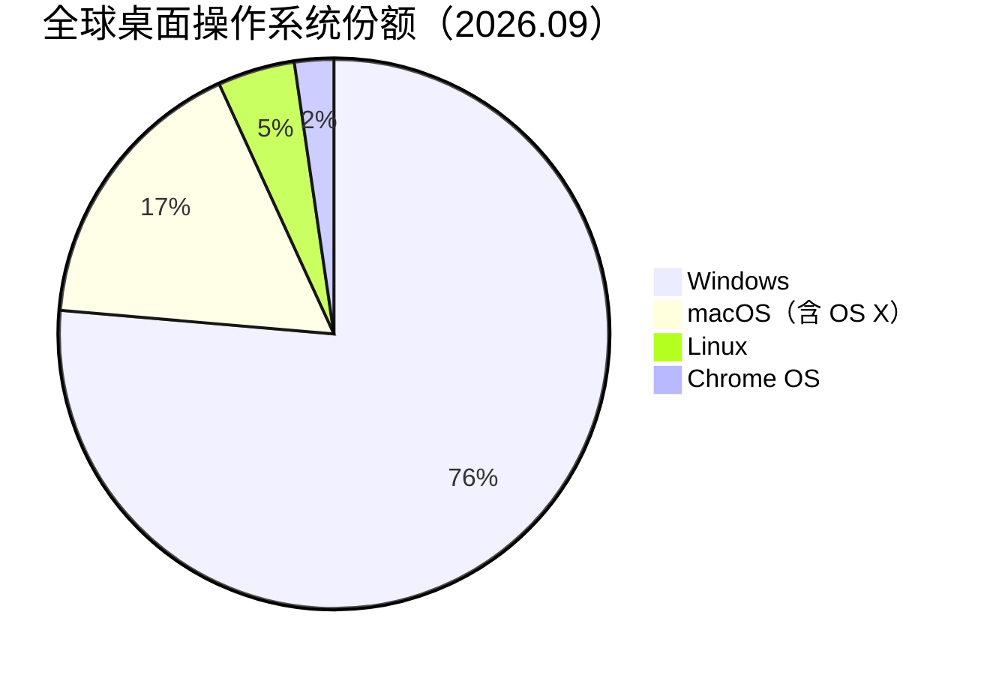
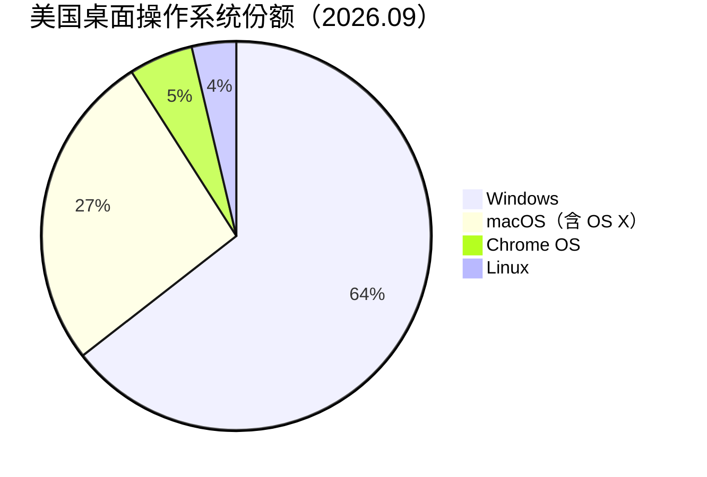
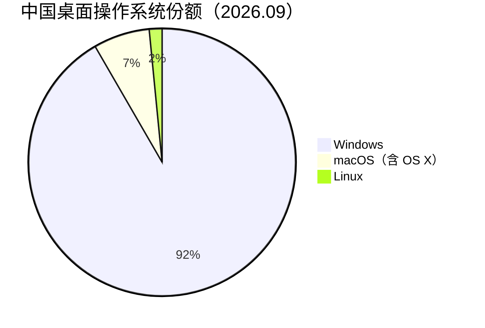
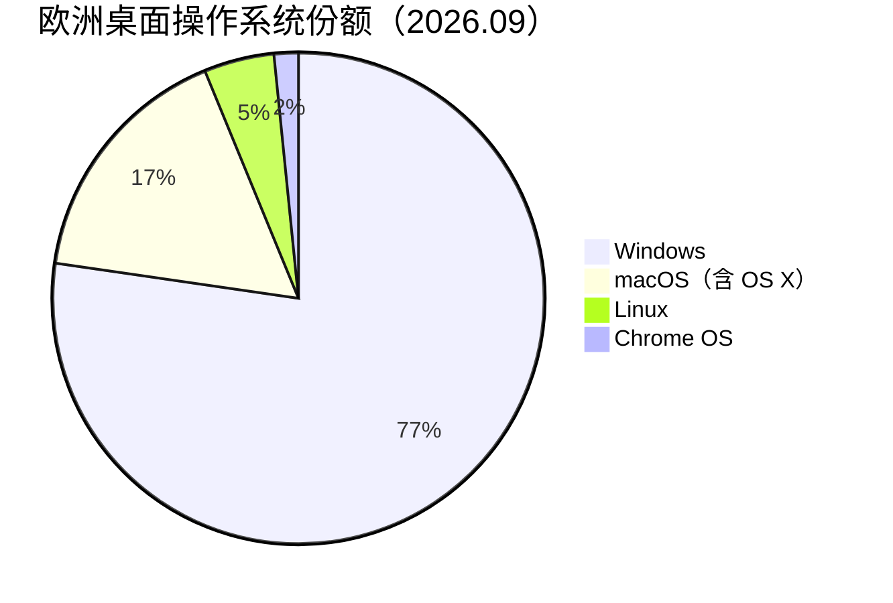

## Windows 仍然是桌面操作系统的绝对主力，但中美欧三个市场的格局差异悬殊

StatCounter 2026 年 9 月的数据显示，全球桌面端 Windows 占据 76.36% 的市场份额。这个数字在过去十年里几乎没怎么变过。

macOS 阵营（含 OS X）合计 16.78%，Linux 4.54%，Chrome OS 2.31%。Windows 与 Apple 之间的差距大约是 4.5 倍，这个差距从 Vista 时代一直延续到现在。

但把镜头拉近到具体市场，Windows 的主导地位出现了明显的区域性差异。中国的 Windows 渗透率接近 92%，美国降至 64% 左右，欧洲介于两者之间。同样是消费市场，同样是普通用户的日常电脑，操作系统的选择呈现出完全不同的格局。

## 全球桌面操作系统份额

Windows 76.36% 这个数字背后有一个结构性原因。全球 PC 出货量中，Windows 授权设备每年超过 2.2 亿台（含 OEM 预装和零售渠道），Apple Mac 年出货量约 2500 万到 3000 万台。Linux 在消费级桌面几乎没有预装渠道，Chrome OS 则主要依赖低价 Chromebook 在教育市场和入门消费市场的渗透。

StatCounter 的数据来自网站流量采集，反映的是活跃上网用户的操作系统分布，而非设备保有量的精确普查。这两者之间存在系统性偏差。StatCounter 的客户网站受众往往偏向互联网活跃用户，可能对 Linux 等特定操作系统的用户有一定程度的高估。

## 中美欧三大市场对比

### 美国

美国是三大市场中 Apple 渗透率最高的。macOS 阵营合计 26.51%，接近 Windows 份额的四成。这与美国市场的几个特征相关。苹果零售门店网络覆盖充分，MacBook 是创意产业和科技行业的事实标准工具，iPhone 到 Mac 的生态绑定降低了用户的切换成本。Chrome OS 在美国有 5.34% 的份额，主要来自主流教育机构的 Chromebook 采购和低价入门设备。

Linux 在美国只有 3.69%。开发者群体中 Linux 的使用率远高于这个数字，但开发者在普通网民中的占比有限。

### 中国

中国的桌面市场几乎是 Windows 的单一主导。91.65% 的份额意味着全球绝大多数 Windows 设备集中在这个市场。这个比例由多个因素共同决定。中国是全球最大的 PC 出货量市场，主流品牌（联想、惠普、戴尔等）在中国市场的产品线几乎全部预装 Windows。国产操作系统（统信 UOS、deepin、麒麟）虽然存在，但在消费级市场的渗透率极低，主要面向政企信创采购。

macOS 在中国仅有 6.8%。Mac 产品在中国的定价策略相比美国市场偏高，加之本地化的 App 生态和创意行业软件适配不如英语市场成熟，限制了它在普通消费者中的扩散。Apple 在中国的 Mac 销量更多集中在高端消费和特定行业（设计、开发、金融）用户群体。

Linux 在中国消费级市场的份额为 1.55%，是三大市场中最低的。虽然中国有大量 Linux 开发者，但消费级 Linux 发行版（如深度 Deepin、Ubuntu 中文社区版）的用户基数相对于 14 亿人口的互联网用户总量而言仍然非常有限。

### 欧洲

欧洲介于全球均值和美国之间。Windows 77.28%，与全球水平基本一致。macOS 16.50% 略高于全球均值，这反映了西欧主要经济体（德国、英国、法国、北欧）的 Apple 消费传统。Linux 4.61% 是三大市场中最高的，这与欧洲开源社区的活跃程度相关。

Chrome OS 在欧洲仅 1.6%，与美国 5.34% 形成鲜明对比。Chromebook 在美国教育市场的渗透远超欧洲同类市场。

## Linux 在消费市场的位置

Linux 在全球桌面市场份额约 4.5%，在普通消费者中几乎可以忽略。但 Linux 的真实使用情况比这个数字复杂得多。

开发者群体中的 Linux 使用率远超平均水平。Stack Overflow 2024 年开发者调查显示，约 28% 的开发者在日常工作中使用 Linux（包括 WSL 和双系统），这个比例在资深开发者和技术决策者中更高。但开发者在网民总量中只占很小一部分。

CentOS 需要单独说明。CentOS 从来不是消费级桌面操作系统，它是 Red Hat Enterprise Linux 的社区克隆版，主要面向服务器和数据中心部署。2024 年 CentOS 7 到达生命周期末期后，Red Hat 推出了 CentOS Stream 作为替代品，但它同样定位于服务器场景。在消费级桌面讨论中，CentOS 基本没有存在感。

消费级 Linux 发行版中，Ubuntu 是最大的。根据 distrowatch 的下载量和在线讨论热度数据，Ubuntu 在全球桌面 Linux 发行版中排名第一，其次是 Fedora、Linux Mint 和 Arch Linux。但这些数据反映的是技术社区的热度，不是实际用户安装量。

## 数据来源与方法论边界

本文主要数据来自 StatCounter Global Stats，数据采集方式为网站用户流量统计。以下因素影响数据的代表性。

**受众偏差。** StatCounter 的统计基于其客户的网站流量。这些网站的用户群体并不等于全体网民。技术类网站、博客、小型商业网站的用户可能更倾向于使用某些操作系统。

**OS 分类合并。** StatCounter 将 OS X 和 macOS 分开统计。OS X 是 macOS 之前的旧品牌名称，两者都是 Apple 桌面操作系统。本文将它们合并为 macOS（含 OS X）。

**桌面 vs 全平台。** 本文仅关注桌面设备（台式机、笔记本、一体机），不包含手机和平板。全平台数据中 Android 占 42.54%，远超任何桌面 OS。

**出货量数据缺口。** 本文未能引用 IDC 或 Canalys 的 PC 出货量报告。这些报告的公开摘要通常给出 Windows PC 出货量占 90% 以上的比例，与 StatCounter 的流量数据方向一致但数值不同。出货量数据更精确地反映设备保有量，StatCounter 反映的是活跃网络使用行为。

## 一个基本判断

桌面操作系统市场的格局在 2026 年依然稳固。Windows 在绝大多数市场中保持主导地位，Apple 在高端和创意产业用户中占据不可替代的位置，Linux 在消费者层面的存在感仍然微乎其微。区域差异主要来自于渠道结构、生态成熟度和购买力水平，而非操作系统本身的技术优劣。

对于开发者而言，这个市场格局意味着 Windows 兼容性是桌面应用的底线要求，macOS 支持是覆盖创意行业和专业用户的必要条件，Linux 兼容性则是技术用户和企业 IT 场景的加分项。

---

数据来源
- [StatCounter Global Stats - Desktop OS Market Share Worldwide (2026.09)](https://gs.statcounter.com/os-market-share/desktop)
- [StatCounter - Desktop OS Market Share in United States (2026.09)](https://gs.statcounter.com/os-market-share/desktop/united-states-of-america)
- [StatCounter - Desktop OS Market Share in China (2026.09)](https://gs.statcounter.com/os-market-share/desktop/china)
- [StatCounter - Desktop OS Market Share in Europe (2026.09)](https://gs.statcounter.com/os-market-share/desktop/europe)
